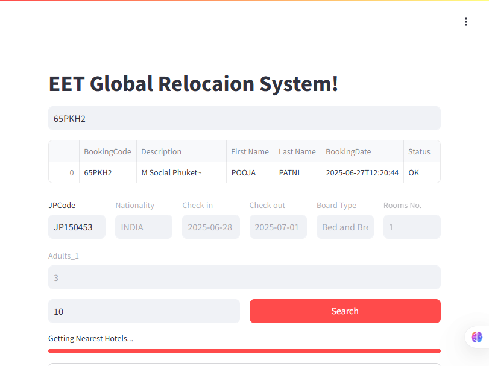
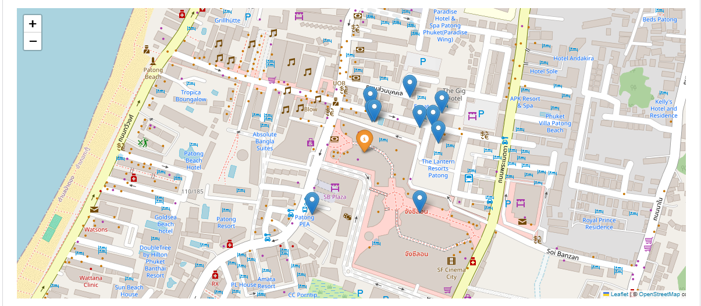

# 🏨 EET Hotel Relocation System

A smart web application built with **Python** and **Streamlit** to automate and optimize the hotel relocation process based on booking details, room configurations, and geolocation. The system fetches booking data from Juniper APIs, identifies nearby hotels using `geopy`, and visualizes availability using an interactive map.

---

## 📌 Features

- 🔎 Search and validate bookings via SOAP-based API
- 📍 Identify nearest hotels using GPS coordinates
- 🧠 Intelligent room mapping: adults, children, and ages per room
- 📊 Filters hotels by board type and acceptable price range (±20%)
- 🗺️ Visual map of nearby hotels using Folium
- 🧾 Interactive booking summary and room breakdown
- 🔗 Quick link to Call Center for manual override

---

## 🛠️ Tech Stack

| Tool       | Role                                 |
|------------|--------------------------------------|
| Python     | Core business logic and integrations |
| Streamlit  | Web interface                        |
| Folium     | Interactive maps                     |
| Geopy      | Distance calculation between hotels  |
| Pandas     | Data manipulation                    |
| Asyncio    | Concurrency for API calls            |
| Juniper API| Booking & availability integration   |

---

## 📂 Project Structure

```
RelocationSystem/
├── Relocation.py             # Main Streamlit app
├── HotelsAvailabiltyApi.py  # Async hotel availability logic
├── EET_External_Temp.xlsx   # Hotel metadata (Excel)
├── requirements.txt         # Dependencies
├── README.md                # Project documentation
```

---

## 🚀 How to Run Locally

```bash
# Step 1: Install dependencies
pip install -r requirements.txt

# Step 2: Run the app
streamlit run Relocation.py
```

---

## 🖼️ Screenshots

```markdown


```

---

## 📈 Business Impact

- 🕒 Saves call center time by suggesting filtered nearby hotels
- ✅ Improves decision-making speed with interactive visuals
- 💡 Enhances booking recovery workflow by showing only available, relevant options

---

## 👨‍💻 Developed By

**Eng. Amr Atef**  
Senior Data Analyst | Python Automation | Data Engineering Enthusiast
[GitHub](https://github.com/AmrAtefAmer) • [LinkedIn](https://linkedin.com/in/amr-atef-665336151)
